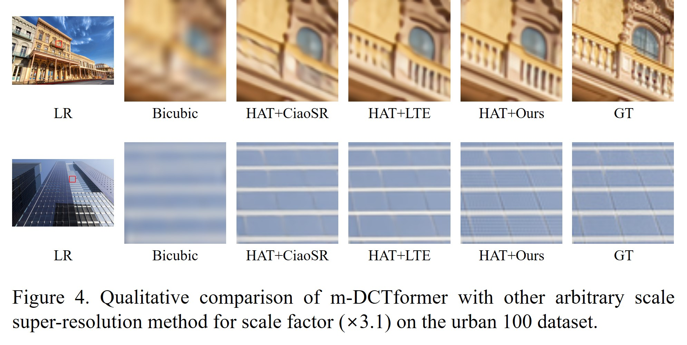
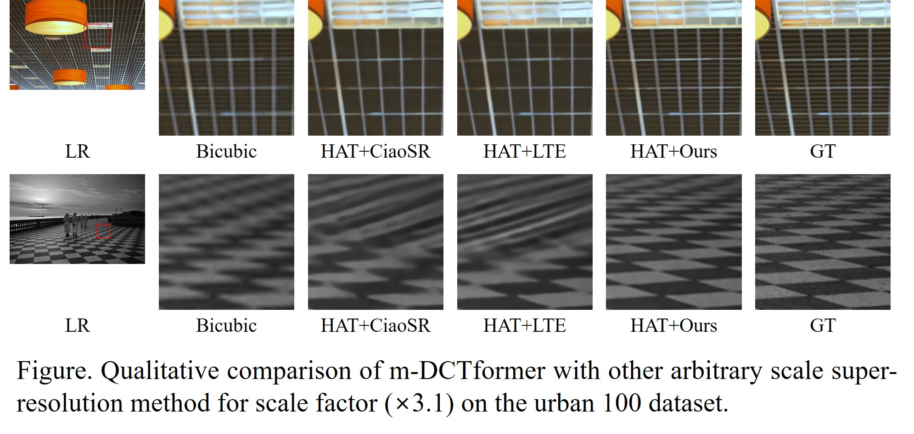
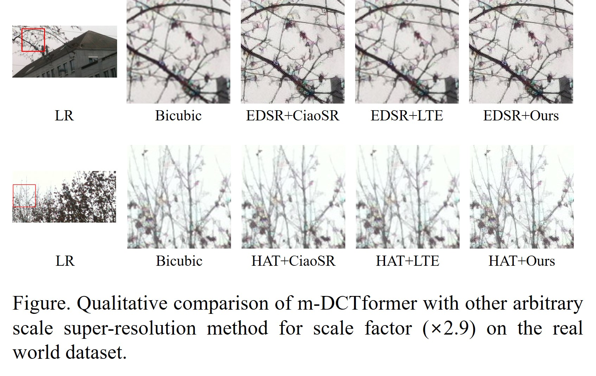

#
m-DCTformer: Memory-Efficient DCT Domain Weight Modulation Transformer for Arbitrary-Scale Super-Resolution

This code is the PyTorch implementation of m-DCTformer.

  

  

  

  

 

# Demo Video
download link : https://drive.google.com/file/d/1SjaKge9VnREX1TXnpRPcuqMj9VbVIfKd/view?usp=sharing

# Datasets

Images dir : '../DIV2K_dataset/benchmark/Set5/HR'

# m-DCTformer weights
https://drive.google.com/file/d/1OzgnpXWDEkUvJOaldArk0yT-rRqAZgyZ/view?usp=sharing, https://drive.google.com/file/d/1jAC0sDJx4qTbTijLDQuXJ4077vHDb2Tm/view?usp=sharing

dir:
'./weights'

## Create enviroments
pip install -r requirements.txt

## Quick Run for Set5 X4.9
python main.py --test_only
